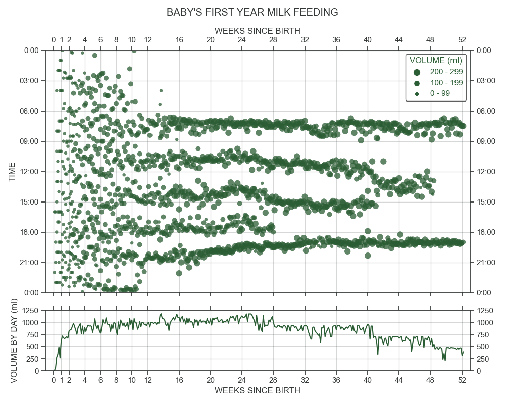

# BABY FEEDING SCHEDULE

This project visualizes the milk (breastmilk + formula) intake during the first year in the life of a baby. This visualization shows how a (feeding) rythm started to form in our baby, and how it changed over the course of its first year. Because of the minimal sample size, both the daily quantity of food and the timing of rythm changes should not be used for extrapolations or to set expectations for other individuals. Always follow the cues of your own baby!

## DATA COLLECTION

During the initial days of weaning, we quickly noticed that the baby did not acquire sufficient nutrients through breastfeeding. Thus, we shifted to bottle-feeding, both breastmilk and formula. This allowed for accurate tracking of intake - we measured it with 5 ml intervals. We kept track of feeding times and quantities for the full first year of the baby's life. Time and quantity was written down on paper and later digitized into a .CSV. We also tracked (approximate) poop frequency but this was ignored for this analysis.

### CAVEATS

Over the course of the first year, the baby started eating other foods as well. This started with little bits of fruit and vegetable (+/- 20 ml a day) but over the year grew to rather large meals (2 sandwiches for lunch, 200-300 grams of food for dinner). These quantities were not tracked. Furthermore, the first bottle of the day was supplemented with grains to create a (drinkable) porridge. The quantity of porridge was included in the graph but this is not discernable from other bottles.

## SCRIPT

The script included in this repository reads the data from CSV, transforms it and plots the data in a scatter- and a line plot. The scatterplot shows the days since birth (x-axis) and time of day (y-axis) which nicely shows the arrival of rythm and the changes from 5 gradually down to 2 bottles a day. The line plot aggregates the food volumes by 24 hour day. This plot shows the rapid rise in milk volume the baby needed - it has always been and still is a very hungry baby, the occasional plateaus and gradual decline of milk volume consumed. 

## RESULT

## REPLICATION

To replicate this plot, you can use the supplied code and the data_example.csv. This contains a few rows of dummy data. Of course you should add your own data, but this requires (1) a baby and (2) a long period of data collection. I'm happy to see other rythms arrise, so please share your results if you are able to replicate this plot.

## AUTHORS

Mike Fleuren Ph.D.
